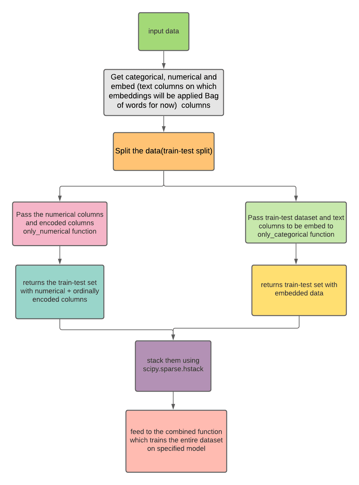

# Explainable-AI

Refer here for [video demo](https://drive.google.com/file/d/1pL8vyxGFws3vWkY4hEg4JHXyKUDZ43t_/view?usp=sharing) and [here](https://colab.research.google.com/drive/1XnDVonlYbjvfrR8E6wnUy_GAuZuIn-F4?usp=sharing) for notebook demo

The intuition behind the architecture and working is that to provide a general framework that explains a model behaviour (right now support only linear classifier models (LogisticRegression, SGDClassifier, LinearSVC), models which return coefficients after training.

Now, when you train a classifier model on a dataset you don’t know its behaviour of predictions, that why the model outputs a particular value.
So  we provide functions(**explain_local**, **explain_global**) to explain the predictions of a model .  

# Architecture and working 

## Different Components

## Explain Local

Function to evaluate global results
* First we plot heatmap of missing values in dataframe using seaborn.
* Then missing predictions is a helper function which checks whether the model is unable to predict a particular class  and returns a boolean value whether its   missing predictions and the list of predictions its missing.
* If training is false: 
  * We divide the columns in numerical and categorical columns
  * If the max length of values in categorical columns is greater than 2 we classify them as embed columns (columns of which text embedings will be applied)    
  * Ordinal Encoding can be applied on remaining categorical columns (i.e Categorical_columns - embed_columns) 
  * Now we split the dataset (train-test split)
  * Then we have three functions only_cat, only_numerical, combined
  * Then we train the combine dataset and evaluate result

**Note:** If model is trained then we simply do train-test split and calculate predictions and evaluate results like we did before.

**check(df , model, target_col_name, num_cols=None,embedings=None)**  

**Necessary parameters:** df, model, target_col_name    

dataframe for which you want explanations, model, name of the target column (right now now it supports only numerical target column, if they are categorical , encode them),   

**Optional arguments**: cat_cols, num_cols, embedings    

Specify names of numerical columns in the form of lists, also specify the embeddings as dictionary like **{'feature_names' : feat_names, 'embeddings_values' : values}**   

Where feat_names are feature_names from Countvectorizer and values are the embedded values

## Explain Global 

**explain_global(df , model, target_col_name, training=True, test_size = 0.33)**

**Necessary parameters: df, model, target_col_name**

dataframe for which you want explanations, model, name of the target column (right now now it supports only numerical target column, if they are categorical , encode them),

**Optional arguments: training, test_size**

specify only when model is not trained(by default its True). 

test_size as we will perform train_test split to evaluate  models performance (by default it’s value is 0.33)

## Different Components

### Explain Global

Function to evaluate global results

* First we plot heatmap of missing values in dataframe using seaborn.
* Then missing predictions is a helper function which checks whether the model is unable to predict a particular class  and returns a boolean value whether its missing predictions and the list of predictions its missing.
* If training is false: 
  * We divide the columns in numerical and categorical columns
  * If the max length of values in categorical columns is greater than 2 we classify them as embed columns (columns of which text embedings will be applied)    
  * Ordinal Encoding can be applied on remaining categorical columns (i.e Categorical_columns - embed_columns) 
  * Now we split the dataset (train-test split)
  * Then we have three functions only_cat, only_numerical, combined

`def only_cat(df, embed_cols, model, target_col_name, X_train, X_test, y_train, y_test):`

* In this function we pass embed columns and our train-test split dataframes
* First we apply bag of words embedings on each embed column and then stack them together using scipy.sparse.stack, we also return these values, so we can use them later when calling the combined function)
* Then we train the model, get predictions, accuracy and classification_report.
* Evaluate_result function evaluates the result of classification_report, then we plot barplot and also plot the wordcloud  of the most occuring words.

`def only_numerical(df, model, num_cols, ordinal_encode_cols, target_col_name, X_train, X_test, y_train, y_test)`

* In this function we pass columns to be ordinally encoded and our train-test split dataframes
* First we use OrdinalEncoder on each ordinal_encode_cols, we also return these values, so we can use them later when calling the combined function)
* Then we train the model, get predictions, accuracy and classification_report.
* Evaluate_result function evaluates the result of classification_report, then we plot the feature importances and look for reasons of columns with low feature importances.

## Explain Local

`def explain_local(df , model, target_col_name, num_cols=None, embedings=None)`

* Function to evaluate local results

* Pass the dataframe,  model, name of target columns, and specify num_cols, embedings.

* Specify names of numerical columns in the form of lists, also specify the embeddings as dictionary like **{'feature_names' : feat_names, 'embeddings_values' : values}**

* Where feat_names are feature_names from Countvectorizer and values are the embedded values

 
* First we check the value counts of target variable then we check whether embedings were passed and evaluate results.
* Then we check the type of model passed and verify that they are only linear models (as it supports linear models for now).
* Then we get predictions, accuracy and classification_report.
* Evaluate_result function evaluates the result of classification_report, then we plot the feature importances and look for reasons of columns with low feature importances.

